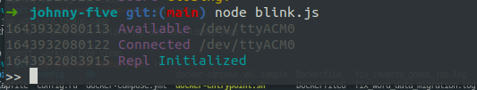

## IoT on JS Research (Ongoing)
[Circle Software](https://circlepos.com/ "Circle Software") allowed us to do a research as a side project and expand the horizons beyond work and that could potentially others solving problems as well.

So for me, I did a research about IoT and I found out that I can use Javascript to run a Microcontroller(Arduino). I needed to buy an Arduino Kit to proceed with this research as I cannot simulate this in computer alone.

### Prerequisites
- Arduino / Raspberry Pi 3 - [(Comparison of Arduino vs Raspi)](https://electronicshub.org/raspberry-pi-vs-arduino/#:~:text=The%20main%20difference%20between%20them,supply%2C%20programming%20and%20IO%20Connectivity.http:// "(Comparison of Arduino vs Raspi)")
- Node LTS
-  Johhny Five - The JavaScript Robotics & IoT Platform - http://johnny-five.io/
- Arduino App - can be downloaded somehwere or use your respective package manager https://chocolatey.org/ - (Windows) / `apt get` command (Linux) / https://brew.sh/ -  (Mac)
  - StandardFirmata - (to be uploaded to your processing unit)

### Setup for your Arduino
1. Plug your Arduino
2. Open File > Examples > Firmata > StandardFirmata
3. Upload this to your Arduino and wait it to compile successfully.
4. Once uploaded successfully, you can now communicate this with your basic program.

### NodeJS App basic setup - On your computer
1. Download this repository and go on your terminal and run the following commands:
  i. `npm install` - this will install everything including johnny-five
  ii. `node blink.js` - using node command we are executing `blink.js` app

> If you have successfully setup the things above:

You might be seeing on your terminal and realilty  

  

 

### What's Next To This Project?
I am planning to integrate this with [Pipedream](https://pipedream.com/) and having a basic remote integration wherein You can use this interface to turn off / turn on the led(or something else).

The real world use case would be something like: when I switched on a light in the office and forgot it to turn it off after going home. I'll just get on my phone and I'll switch on my app that will serve as a remote controller but can control it over the internet.

### More resources I can use in the future but not yet this time:
- Pipedream - https://pipedream.com/
- Shrinking Arduino Projects - https://www.youtube.com/watch?v=30rPt802n1k